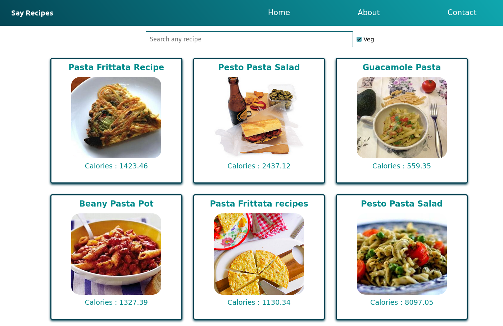

# Say Recipes - Recipes that speak about itself

[](./LICENSE.md)

**Recipes, recipes, recipes!!** **_Ingredients, calories and more!!_** This webapp says a lot about recipes..



## Prerequisites

Make a `.env.local` file, with the similar contents as that of `.env.sample` file, in the root directory of the project, and paste the actual environment variables there.

Then, run below command:

```sh
npm install
```

## Run and Build the Webapp

In the project directory, you can run:

- `npm run netlify:dev`: Runs `react-scripts start`, but with netlify functions also served in our local environment.
- `npm start`: Runs the webapp in the development server.
- `npm test`: Launches the test runner in the interactive watch mode.
- `npm run build`: Builds the webapp for production to the `build` folder.

## Notes for Developers

- Don't add any `bugs`, `homepage`, or `repository` urls/fields in the `package.json`:

  - When I had put those fields in the `package.json`, ReactJS thought to serve the static files like css and optimized build of js files from `https://<hostname>:<port>/<my-git-profile-username>/<repo-name>/<static-file-name>`, instead of the usual url: `https://<hostname>:<port>/<static-file-name>`, and this issue led to 404 not found of that static file..
  - Have to check more why this was the case/issue. But for now, I don't need those fields mandatorily.

- Before deploying to **netlify**, remember below points:

  - Upgrade node and npm to latest version, and also specify node and npm versions in `engines` field in the `package.json` file.
  - Don't even keep any warnings in the output of `npm run build`.

    This is bcoz those warnings are treated as errors, as `process.env.CI = true` is set by most CI servers automatically. If we require to keep the warnings as it is, then we should prefix our build command with `CI= `, which will unset this CI to empty, and it will help build the webapp fine.

- Netlify Serverless Functions:

  - We have made a netlify serverless function, in the file [./netlify/functions/fetch_recipe_data.js](./netlify/functions/fetch_recipe_data.js).
  - This will be the handler for the route, and it will return a response..
  - The path to which we would send the request from the client side is actually the same path name as that of the filename of the handler. We can invoke that handler by calling `fetch` or some `axios` methods from client side code, with the url passed as `'/.netlify/functions/fetch_recipe_data?query_param_key=my_value'`.
  - Note that by default, the serverless functions are created inside the directory: `<root-of-the-project>/netlify/functions`.
  - Also note that the url to be requested will be like `/.netlify/functions/<handler-name>?optional_query=value/optional_param`.
  - Note the extra `.` (dot) in the url before the `netlify/functions`, and it is bcoz netlify-cli creates a temporary runtime build folder named as `.netlify`.
